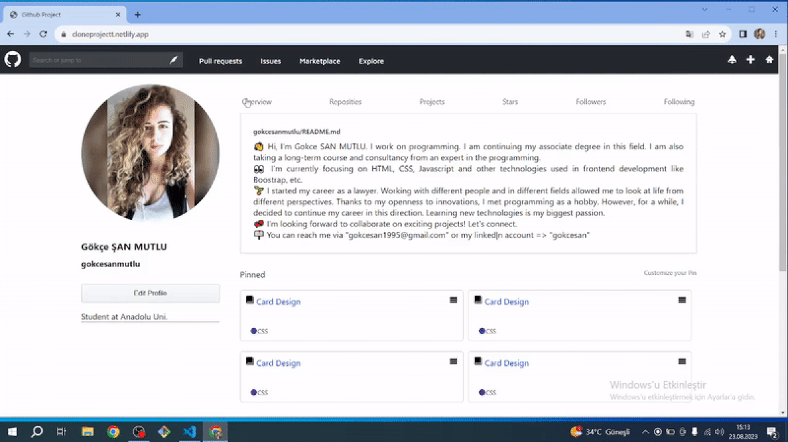

# GithubClone

<!DOCTYPE html>
<html lang="en">
<head>
    <meta charset="UTF-8">
</head>
<body>
    
  
In this work, Github page recoded with minor changes

<h2 id="built-with">Built With</h2>
  <ul>
    <li>HTML</li>
    <li>SCSS</li>
  </ul>
  
You can reach to Website, when you are click <a href="https://cloneprojectt.netlify.app/">HERE</a>.

</body>
</html>

Screenshot

